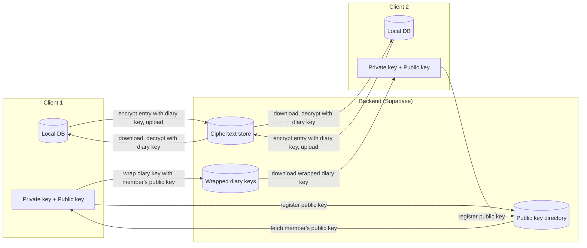

# Architecture

## Overview

An offline-first shared journaling app where small groups of people write into the same diary together. A diary is a private space shared by its members: everyone in it can write entries and read everyone else's. All diary content is protected by end-to-end encryption, meaning the backend server stores and relays encrypted data but can never read entry content.

Private journaling is not a separate feature — a personal diary is simply a diary with one member.

## Goals & Non-Goals

The first version of the app will include these features:

- **Shared diaries**: users can create a diary and invite friends into it. Every member can write entries and read all entries in that diary.
- **Simple rich text entries**: users can write entries with basic formatting (headers, italics, bold) and attach one photo per entry.
- **Offline-first journaling**: users can write, edit, and view entries on their phone without an internet connection. Changes sync automatically the next time the app is online.
- **End-to-end encryption**: entry content is encrypted on-device before it's sent to the backend. Each diary has its own encryption key, and that key is delivered to each member encrypted with that member's public key. The backend server never has access to plaintext content or to any user's private key.
- **Friend system**: users add friends using a unique code rather than by search, so accounts are not discoverable. Friends are the pool of people who can be invited into a diary.
- **Multi-author timelines**: entries inside a diary are attributed to whoever wrote them.
- **Basic social interactions**: members can react to and comment on entries within a diary.

The first version of the app will **not** include:

- **Multi-device sync**: only one primary device per user is supported. That device stores content locally and holds the private key used to unwrap diary keys.
- **No explore, feed, or public profiles**: the app has a diary list and a per-diary timeline. Profile information (display name, photo) is visible only to accepted friends.
- **No rich media beyond photos**: audio and video attachments are not supported.
- **No full access revocation**: removing a member hides future entries from them, but a former member still holds the diary key locally and could decrypt content they already downloaded. True revocation would require rotating the diary key and re-encrypting all existing entries, which is out of scope for v1.
- **No account recovery**: if a user loses their device without a backup of their private key, their encrypted content is unrecoverable. This is a known, accepted limitation.

## Encryption & Sharing Flow

Encryption happens in two layers:

- **Entry content** is encrypted with a **symmetric diary key** — one key per diary, shared by all its members. This means an entry is encrypted and stored exactly once, no matter how many members the diary has.
- **The diary key itself** is encrypted (wrapped) with **each member's public key**, so only that member's private key can unwrap it. This is the only part that is duplicated per member, and it is small.

### Step-by-step: creating a diary and adding a member

1. A user creates a diary. Their device generates a new symmetric key for it, the diary key.
2. The device wraps the diary key with the creator's own public key and uploads it, so the creator can recover the key on future sessions.
3. To add a friend, the device fetches that friend's public key from the backend's public key directory.
4. The device wraps the same diary key with the friend's public key and uploads it as a new membership record.
5. The friend's device downloads their wrapped diary key and unwraps it using their own private key, recovering the diary key. It is cached locally so it doesn't need re-unwrapping on every launch.

### Step-by-step: writing and reading an entry

1. A member writes an entry. It's saved as plaintext in their local database immediately, so it's available offline right away.
2. The device encrypts the entry using the diary key and uploads the ciphertext. It is stored once, regardless of how many members the diary has.
3. Other members' devices download the ciphertext.
4. Each member decrypts it using their locally cached copy of the diary key.
5. The decrypted entry is saved into that member's local database, so it remains viewable offline.

At no point does the backend hold a diary key in unwrapped form, or any user's private key.

## Data Models

### Local DB schema (SQLite)

#### Table: `diaries`

Local cache of the diaries the user belongs to, so the diary list works offline.

- **id**: used to uniquely identify the diary; matches the backend's `diaries.id`.
- **name**: used to display the diary's title.
- **diary_key**: used to encrypt and decrypt entries in this diary. This is the unwrapped symmetric key, cached locally after being recovered once with the user's private key.
- **created_at**: used to sort and display diaries.

#### Table: `entries`

Local cache of decrypted entries across all diaries the user belongs to, plus entries written offline that haven't synced yet.

- **id**: used to uniquely identify the entry, generated on-device (UUID) at creation time so offline-created entries have a permanent ID before syncing.
- **diary_id**: used to know which diary this entry belongs to.
- **author_id**: used to attribute the entry to whoever wrote it, since a diary has multiple authors.
- **title**: the entry's title, plaintext.
- **body**: the entry's main content, plaintext.
- **mood**: the author's selected mood or tag for the entry.
- **photo_uri**: local file path to the attached photo, if any.
- **created_at**: used to sort entries chronologically within a diary.
- **updated_at**: used to know when the entry was last edited, and to resolve sync conflicts by comparing timestamps to decide which version is newer.
- **synced_at**: used to build the sync queue; entries where `synced_at IS NULL` still need to be uploaded.

#### Table: `friends`

Local cache of accepted friends and the public keys needed to invite them into a diary.

- **id**: used to uniquely identify this local cache record.
- **friend_user_id**: used to reference this friend's backend user id.
- **display_name**: used to show the friend in the UI.
- **public_key**: used to wrap a diary key for this friend when inviting them, cached locally so invitations work with a flaky connection.

### Backend schema (Postgres / Supabase)

#### Table: `users`

- **id**: used to identify the user, and as the foreign key everywhere else in the backend.
- **email**: used by Supabase Auth to authenticate the account. Not used for friend search or discovery.
- **public_key**: used by other users to wrap a diary key for this user. Safe to expose.
- **display_name**: used for display, readable only by accepted friends via row-level security.
- **created_at**: used to record account creation.

#### Table: `diaries`

- **id**: used to uniquely identify the diary.
- **name**: used to store the diary's title.
- **created_by**: used to record which user created the diary.
- **created_at**: used to record when it was created.

#### Table: `diary_members`

One row per member of a diary. This is where per-user key wrapping lives.

- **id**: used to uniquely identify the membership record.
- **diary_id**: used to know which diary this membership belongs to.
- **user_id**: used to know which user this membership belongs to.
- **wrapped_diary_key**: used to store the diary's symmetric key encrypted with this member's public key. Only that member's private key can unwrap it.
- **joined_at**: used to record when the member was added.

#### Table: `entries`

- **id**: used to uniquely identify the entry; matches the client-generated UUID.
- **diary_id**: used to know which diary the entry belongs to. Access is controlled at this level via `diary_members`, not per entry.
- **author_id**: used to attribute the entry to its author.
- **ciphertext**: used to store the entry content, encrypted once with the diary key. The backend never stores plaintext here.
- **created_at**: mirrors the local `created_at`.
- **updated_at**: mirrors the local `updated_at`, used to detect conflicting edits during sync.

#### Table: `friends`

- **id**: used to uniquely identify the friendship record.
- **user_id**: used to identify one side of the relationship.
- **friend_id**: used to identify the other side.
- **status**: pending, accepted, or blocked. Controls whether the two users can invite each other into diaries.
- **created_at**: used to record when the relationship was created.

## Tech Stack

### Frontend (Mobile App)
- **React Native + Expo**
- **Expo Router** — file-based navigation (Diary list, Diary timeline, New Entry, Friends, Settings)
- **TypeScript**
- **Local database**: SQLite via `expo-sqlite` — offline-first source of truth for diaries and entries
- **Secure key storage**: `expo-secure-store` — stores the user's private key and cached unwrapped diary keys in the device keychain/keystore
- **Rich text editor**: `10tap-editor` — WebView-based editor built on Tiptap, provides headers, bold, and italic formatting with a native toolbar

### Encryption
- **libsodium** (`react-native-libsodium`) — asymmetric keypairs for wrapping diary keys, symmetric encryption for entry content

### Backend
- **Supabase (Postgres + Auth + Storage)**
  - **Auth**: email/password or magic link
  - **Database**: `users`, `diaries`, `diary_members`, `entries`, `friends`
  - **Row-Level Security**: a user can read an entry or a wrapped diary key only if a `diary_members` row ties them to that diary; profile fields are readable only between accepted friends
  - **Storage**: encrypted photo blobs, encrypted client-side before upload

## How does sync work?

Sync is handled by custom logic in the RN app rather than a built-in Supabase feature. When the device reconnects after being offline, it pushes any local entries that haven't been uploaded yet (tracked by `synced_at`), and pulls down anything new from the backend — both new entries in diaries the user already belongs to, and any new wrapped diary keys for diaries the user has just been added to. If the same entry was edited on two devices or sessions before syncing, the conflict is resolved with last-write-wins, comparing each version's `updated_at` timestamp and keeping the newer one.