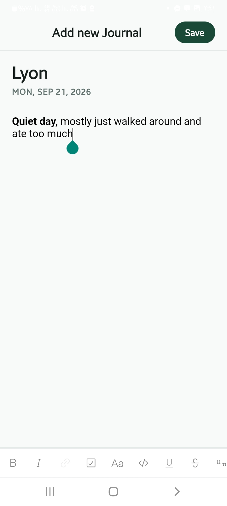
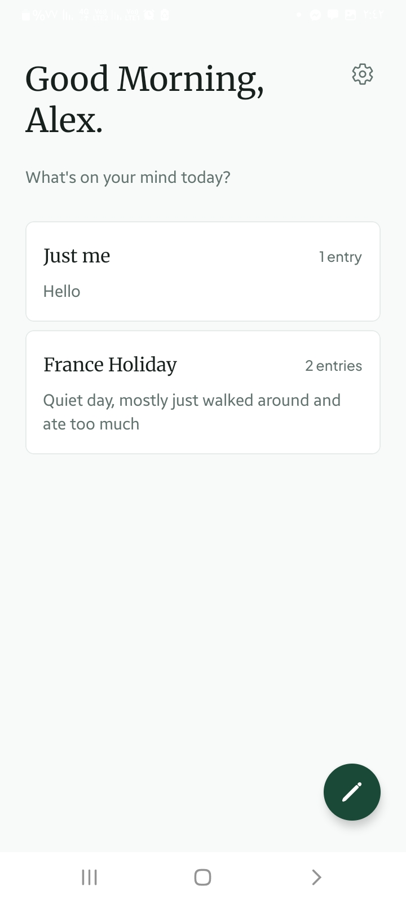
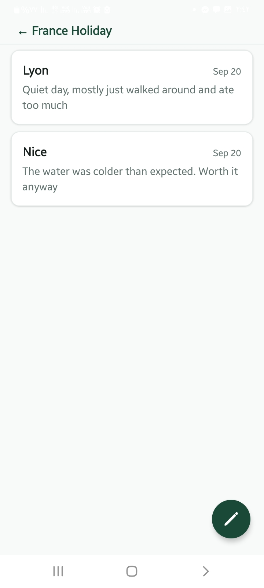
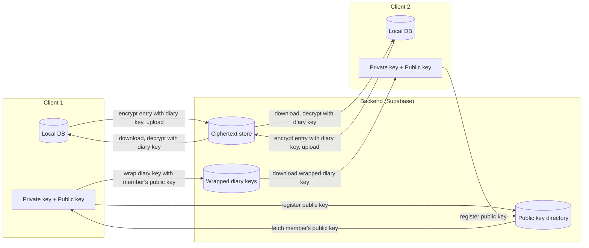

# Quill

## Overview

An offline-first, privacy-focused social journaling app. Create a diary, invite friends, and journal together.

## Screenshots

  
  
  

## Features

- Create diaries and write entries, all available offline and stored in a local database
- View diary entries and revisit memories

## Upcoming Features

These features are planned but not yet implemented.

- Shared diaries: get invited by friends or invite them, and have a safe space to write and view each other's entries
- End-to-end encryption: sharing diaries requires a secure protocol to help ensure reliability, so we are planning to secure data from bad actors who want to exploit it
- More formats supported: we are aiming to support adding images and audio recordings, and support rich styling in the editor

The diagram below shows the planned design for encrypted syncing once this feature is implemented:

## Tech Stack

- **React Native + Expo**
- **Expo Router** — used for navigation between screens
- **TypeScript**
- **Local database**: SQLite via `expo-sqlite`
- **Rich text editor**: `10tap-editor` — used for implementing the editor

---

**Curious to learn more?** See [ARCHITECTURE.md](./ARCHITECTURE.md) for the app's architecture, data models, and more.
